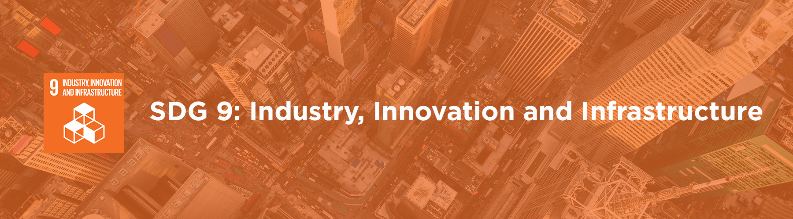

# ATM SYSTEM 💻

<p align="center">
  <a href="https://github.com/Rikku1/ACP_FINAL_PROJECT.git">
    
  </a>
</p>

<p align="center">
  <i><b><code>Jenrick Magtaas IT-2104</code></b></i>
</p>

---

## 📖 Table of Contents
1. [Overview](#-overview)
2. [Python Concepts](#-python-concepts)
3. [Sustainable Development Goal (SDG) Integration](#-sustainable-development-goal-sdg-integration)
4. [Instructions for Running the Program](#-instructions-for-running-the-program)

---

## 🔍 Overview
The **ATM System** is a Python-based application that replicates the essential functionalities of an Automated Teller Machine. Users can securely create accounts, log in, and perform banking operations like checking balances, depositing funds, and making withdrawals. The system supports both Checking and Savings accounts, with unique features such as transaction fees for Checking accounts and automatic interest application for Savings accounts.

The project demonstrates a practical application of Python programming principles and highlights its relevance to digital financial services.

<p align="center">
  
</p>

---

## 🧰 Python Concepts
1. **Abstract Classes and Methods**:
   - The `UserAccount` class serves as an abstract base class, defining a blueprint for Checking and Savings accounts.
2. **Encapsulation**:
   - Sensitive attributes like balance and transaction fees are private, with controlled access through property methods.
3. **Error Handling**:
   - `try`-`except` blocks ensure robust error management for invalid inputs and transactions.
4. **Datetime Module**:
   - Used in `SavingsAccount` to calculate and apply interest based on the elapsed time.
5. **Input Validation**:
   - Ensures proper formatting for account numbers, PINs, and monetary values.

---

## 🪧 Sustainable Development Goal (SDG) Integration
<p align="center">
  
</p>

The ATM System aligns with **SDG 9: Industry, Innovation, and Infrastructure** by promoting financial inclusion and innovation. It demonstrates the potential for digital financial services to empower users by providing access to essential tools for managing finances. By simulating core banking functionalities, the project underscores the role of technology in fostering economic growth and sustainability.

---

## 💻 Instructions for Running the Program
### Step 1️⃣: Clone the repository
```bash
git clone https://github.com/Rikku1/ACP_FINAL_PROJECT.git
cd ATM-System
```

### Step 2️⃣: Run the program
Execute the following command:
```bash
python main.py
```

### Step 3️⃣: Interact with the ATM
- 📝 Create a new account (Checking and Savings accounts are linked).
- 🔑 Log in with your account number and PIN.
- 💰 Perform transactions such as deposits, withdrawals, or balance inquiries.
- 💸 Savings Account applies annual interest automatically.

---

## 🤝 Acknowledgments
- To myself
- Sa inyo po maam, super effort nyo po sa everything, i appreciate you po!!

<p align="center">
  
</p>
